# 独立知识 RAG 服务设计说明 v1.0

## 1. 文档定位

这份文档用于说明我们为什么要做一个独立的知识 RAG 服务，以及第一版知识库为什么采用 Markdown 维护、后续为什么要演进成知识维护平台。

重点不是汇报当前开发进度，而是说明整体设计理念、知识格式、业务人员维护方式、时效性治理、平台化演进方向，以及 RAG 与 Agent 的职责边界。

## 2. 核心设计理念

### 2.1 RAG 是知识依据层，不是最终回复层

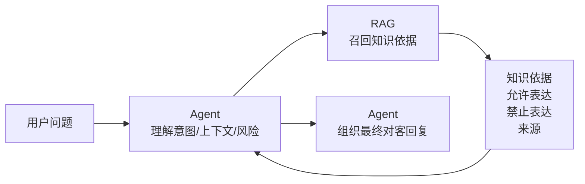

RAG 的职责是：

| RAG 做 | RAG 不做 |
| --- | --- |
| 找到相关知识 | 不直接回复用户 |
| 判断是否可回答 | 不查询订单、余额、退款进度、设备实时状态 |
| 返回允许表达和禁止表达 | 不承诺赔偿、补券、退款等业务动作 |
| 返回来源和版本 | 不替代业务 MCP |
| 记录审计和知识缺口 | 不把低置信结果包装成确定答案 |

这样设计的原因：

- Agent 才掌握完整会话上下文和回复策略。
- 业务实时数据必须来自业务系统或 MCP，不能由静态知识库猜测。
- 高风险业务内容需要明确“哪些能说、哪些不能说”。
- RAG 独立后，可以单独优化知识召回效果，而不影响 Agent 主流程。

### 2.2 知识是业务资产，不是代码附属品

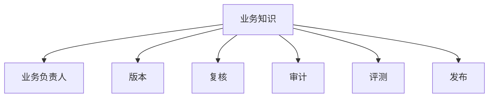

我们的设计不是把 FAQ 简单塞进向量库，而是把知识当成长期维护的业务资产。

因此每条知识都要能回答几个问题：

| 问题 | 对应设计 |
| --- | --- |
| 这条知识是谁负责的？ | `ownerTeam`、`owner` |
| 什么时候开始生效？ | `effectiveFrom` |
| 什么时候失效？ | `effectiveTo` |
| 什么时候需要复核？ | `reviewDueAt` |
| 属于哪个业务域？ | `businessDomain` |
| 属于哪类知识？ | `knowledgeType` |
| Agent 可以怎么说？ | `Allowed Claims` |
| Agent 不能怎么说？ | `Forbidden Claims` |
| 出问题能否追溯？ | `docId`、`knowledgeId`、`chunkId`、版本 |

### 2.3 先用 Markdown 起步，后续平台化维护

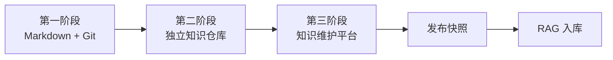

为什么第一版用 Markdown：

| 原因 | 说明 |
| --- | --- |
| 启动快 | 不需要先开发完整后台，能尽快打通 RAG 链路 |
| 可审计 | Git 可以看到谁改了什么、什么时候改的 |
| 可回滚 | 知识改坏了可以回退版本 |
| 格式清晰 | Markdown 对业务文档、FAQ、规则说明天然友好 |
| 便于迁移 | 后续平台可以把表单字段导出成同样结构的 Markdown/JSON 快照 |

但是 Markdown 不是最终形态。中后期我们会建设知识维护平台，让业务人员在 Web 页面填写字段、提交审核、发布知识，而不是长期直接编辑 Markdown。

## 3. 整体架构

### 3.1 系统关系

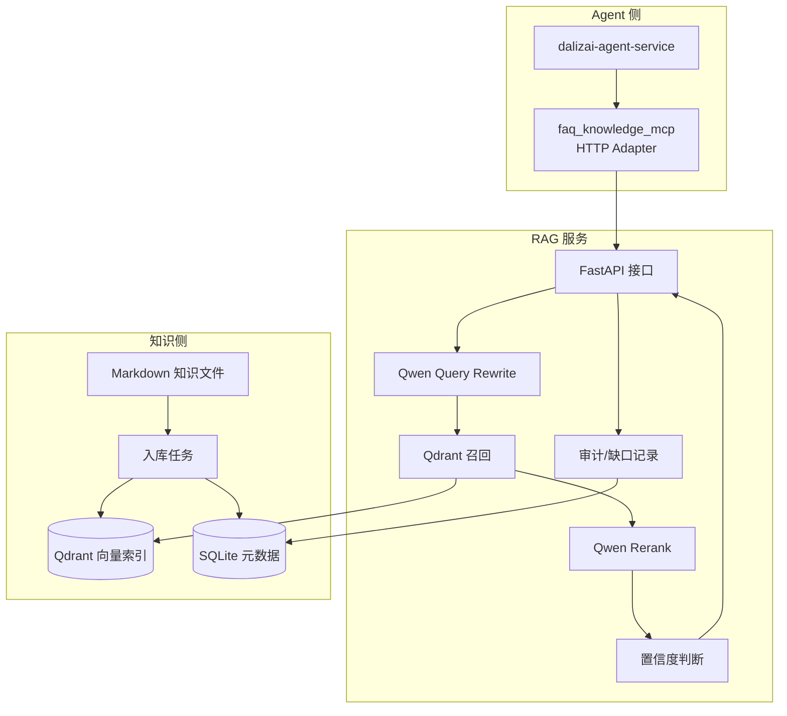

### 3.2 查询链路

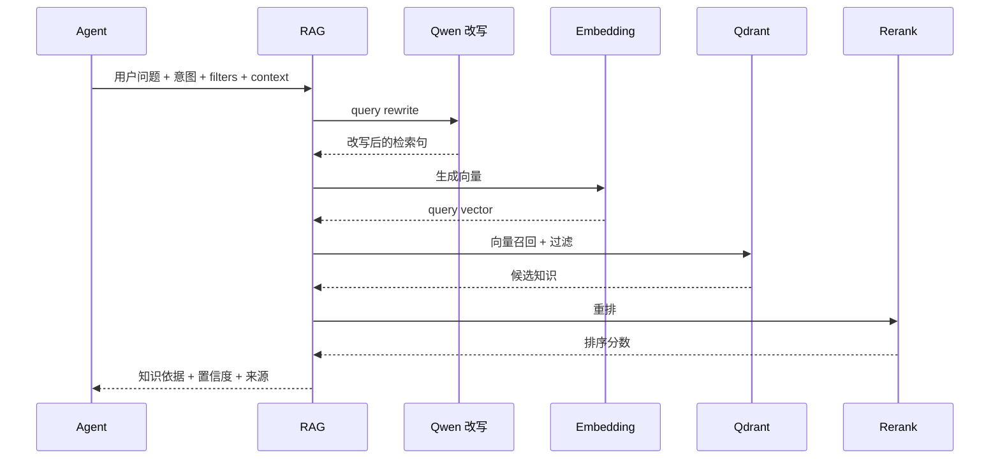

### 3.3 入库链路

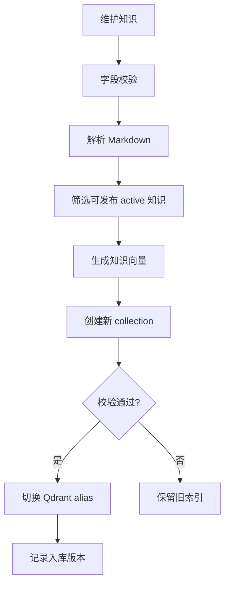

入库采用 alias 发布模式。RAG 查询固定访问稳定 alias，入库失败不会影响当前可用版本。

## 4. Markdown 知识格式设计

### 4.1 目录组织

第一版按业务域组织 Markdown 文件。一个 Markdown 文件是一组同业务域、同知识类型的知识集合；一个二级标题是一条知识。

```text
knowledge/
  charging/
    faq.md
    operation_guide.md
  coupon/
    coupon_policy.md
  refund/
    refund_policy.md
  invoice/
    operation_guide.md
  customer_service/
    handoff_guide.md
    risk_notice.md
```

这样设计的原因：

| 设计 | 原因 |
| --- | --- |
| 按业务域分目录 | 方便业务负责人认领和维护 |
| 按知识类型分文件 | FAQ、规则、故障排查的字段和风险不同 |
| 一个文件多条知识 | FAQ 场景天然会有很多条问答，按文件聚合更易维护 |
| 一条知识默认一个 chunk | 第一版知识较短，便于追溯和评测 |

### 4.2 文档级字段

每个 Markdown 文件顶部有一段 YAML Front Matter，描述这批知识的公共信息。

```yaml
---
docId: doc_charging_faq_v1
docTitle: 充电常见问题
businessDomain: charging
knowledgeType: faq
riskLevel: low
status: active
ownerTeam: 用户运营
owner: 张三
effectiveFrom: 2026-07-23T00:00:00+08:00
effectiveTo:
updatedAt: 2026-07-23T00:00:00+08:00
reviewDueAt: 2026-10-23T00:00:00+08:00
channels:
  - wechat_mini_program
cityCodes:
stationIds:
---
```

字段设计说明：

| 字段 | 业务含义 | 为什么需要 |
| --- | --- | --- |
| `docId` | 文档唯一 ID | 便于版本、审计和问题追溯 |
| `docTitle` | 文档名称 | 方便业务人员识别知识集合 |
| `businessDomain` | 业务域 | 检索过滤，避免跨域误召回 |
| `knowledgeType` | 知识类型 | 支持不同知识使用不同阈值和策略 |
| `riskLevel` | 风险等级 | 高风险知识需要更严格的 forbiddenClaims 和审核 |
| `status` | 知识状态 | 只有 active 参与检索 |
| `ownerTeam` | 负责团队 | 过期复核、知识缺口分派时使用 |
| `owner` | 负责人 | 后续平台提醒到人 |
| `effectiveFrom` | 生效时间 | 防止提前召回未生效规则 |
| `effectiveTo` | 失效时间 | 防止过期活动或旧规则继续生效 |
| `updatedAt` | 更新时间 | 便于判断知识新旧 |
| `reviewDueAt` | 复核时间 | 到期提醒业务人员确认知识是否仍有效 |
| `channels` | 适用渠道 | 区分小程序、App、客服后台等不同渠道规则 |
| `cityCodes` | 适用城市 | 支持城市差异化规则 |
| `stationIds` | 适用站点 | 支持站点差异化规则 |

### 4.3 知识条目格式

一个二级标题是一条知识：

```markdown
## faq_charge_scan_001｜怎么扫码充电？

### Summary
用户连接充电枪后，可以通过小程序扫码启动充电。

### Content
用户连接充电枪后，可在小程序首页点击扫码充电，扫描设备二维码并确认启动。余额不足或设备不可用时，系统会在启动前提示。

### Allowed Claims
- 用户连接充电枪后，可以在小程序中扫码启动充电。
- 余额不足或设备不可用时，系统会在启动前提示。

### Forbidden Claims
- 一定可以启动成功。
- 可以绕过余额校验启动。

### Keywords
- 扫码
- 二维码
- 启动充电

### Similar Questions
- 扫哪里充电？
- 怎么扫二维码启动？
- 不会扫码充电怎么办？

### Eval Questions
[
  {
    "question": "怎么扫码充电？",
    "referenceAnswer": "用户连接充电枪后，可以在小程序中扫码启动充电。余额不足或设备不可用时，系统会在启动前提示。",
    "expectedContextIds": ["faq_charge_scan_001#main"],
    "expectedStatus": "success",
    "expectedClaims": [
      "用户连接充电枪后，可以在小程序中扫码启动充电。",
      "余额不足或设备不可用时，系统会在启动前提示。"
    ],
    "negativeContextIds": [],
    "notes": "扫码充电核心 FAQ。"
  }
]
```

条目字段说明：

| 字段 | 是否必填 | 作用 |
| --- | --- | --- |
| `knowledgeId` | 是 | 知识全局唯一 ID，来自二级标题左侧 |
| 标题 | 是 | 面向业务人员和检索排序都很重要 |
| `Summary` | 是 | 知识摘要，方便 Agent 和观测台快速判断 |
| `Content` | 是 | 知识正文，提供完整依据 |
| `Allowed Claims` | 是 | Agent 可以安全表达的内容 |
| `Forbidden Claims` | 高风险必填 | Agent 不能承诺或不能判断的内容 |
| `Keywords` | 可选 | 增强召回效果 |
| `Similar Questions` | 可选 | 覆盖用户常见口语问法 |
| `Eval Questions` | 模拟/评测建议填 | 用于后续 RAGAS 类评测，不进入正式召回内容 |

### 4.4 knowledge 目录标准模板

后续给业务人员或知识平台使用时，可以把下面这个模板作为标准知识模板。第一版业务人员可以按这个模板提供 Markdown；平台化后，这些字段会被拆成 Web 表单。

```markdown
---
docId: doc_xxx_v1
docTitle: 文档中文标题
businessDomain: charging
knowledgeType: faq
riskLevel: low
status: active
ownerTeam: 负责团队
owner: 负责人姓名
effectiveFrom: 2026-07-23T00:00:00+08:00
effectiveTo:
updatedAt: 2026-07-23T00:00:00+08:00
reviewDueAt: 2026-10-23T00:00:00+08:00
channels:
  - wechat_mini_program
cityCodes:
stationIds:
---

# 文档中文标题

## knowledge_id_001｜知识标题

### Summary
用 1-2 句话概括这条知识，建议不超过 120 字。

### Content
写完整的业务规则、操作步骤、注意事项或处理边界。这里是 Agent 组织回复时的主要依据。

### Allowed Claims
- 这里写 Agent 可以安全表达给用户的事实。
- 每条尽量是独立、清晰、可直接引用的表达。

### Forbidden Claims
- 这里写 Agent 不能说的话，尤其是赔偿、补券、退款、绝对化承诺。
- 高风险知识必须填写。

### Keywords
- 关键词 1
- 关键词 2
- 业务标准词

### Similar Questions
- 用户可能怎么问？
- 口语化问法是什么？
- 还有什么同义问法？

### Eval Questions
[
  {
    "question": "用户测试问题",
    "referenceAnswer": "只基于 Content 和 Allowed Claims 写出的标准参考答案。",
    "expectedContextIds": ["knowledge_id_001#main"],
    "expectedStatus": "success",
    "expectedClaims": [
      "参考答案应该覆盖的事实点"
    ],
    "negativeContextIds": [],
    "notes": "评测说明"
  }
]
```

模板字段的维护建议：

| 模板部分 | 业务人员怎么填 | 平台化后怎么呈现 |
| --- | --- | --- |
| Front Matter | 由业务域、负责人、时效、渠道等公共信息组成 | 页面顶部的基础信息表单 |
| 二级标题 | 左侧是唯一知识 ID，右侧是业务标题 | 知识 ID 输入框 + 标题输入框 |
| Summary | 简短摘要 | 摘要文本框，可自动提示长度 |
| Content | 完整业务知识 | 富文本/Markdown 编辑器 |
| Allowed Claims | 可以对用户说的话 | 可增删的列表控件 |
| Forbidden Claims | 不能对用户说的话 | 高风险知识强制填写 |
| Keywords | 标准关键词 | 标签输入框 |
| Similar Questions | 用户常见问法 | 多行问题列表，可由 badcase 推荐 |
| Eval Questions | 评测问题 | 后续可由平台半自动生成并人工确认 |

### 4.5 当前知识切片规则

第一版采用“一个知识条目一个 chunk”的切片方式。

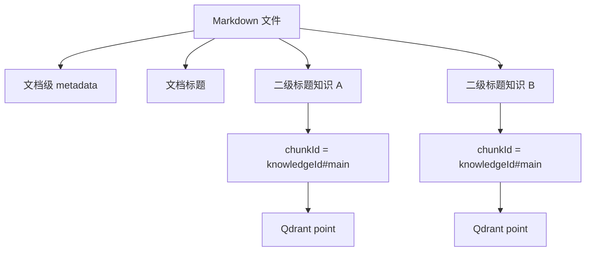

切片规则：

| 规则 | 说明 |
| --- | --- |
| 切分边界 | 每个 `## knowledgeId｜标题` 是一条知识 |
| chunk 数量 | 第一版每条知识默认生成 1 个 chunk |
| chunkId | 默认是 `{knowledgeId}#main` |
| pointId | 由 `chunkId` 生成稳定 UUID，保证重复入库同一知识 ID 可追溯 |
| 文档级字段 | 每条知识继承所在 Markdown 文件的 Front Matter |
| 评测问题 | `Eval Questions` 被解析为评测数据，不进入 embedding 文本 |

为什么第一版不做复杂段落切片：

- 当前知识主要是 FAQ、操作指引、规则说明，单条知识本身不长。
- 一个知识一个 chunk 更利于审计：Agent 命中了哪条知识非常清楚。
- `expectedContextIds` 可以稳定写成 `{knowledgeId}#main`，评测更简单。
- 后续如果某些规则正文过长，可以演进为 `{knowledgeId}#part1`、`{knowledgeId}#part2` 的多 chunk 切片。

### 4.6 为什么要有 Allowed Claims 和 Forbidden Claims

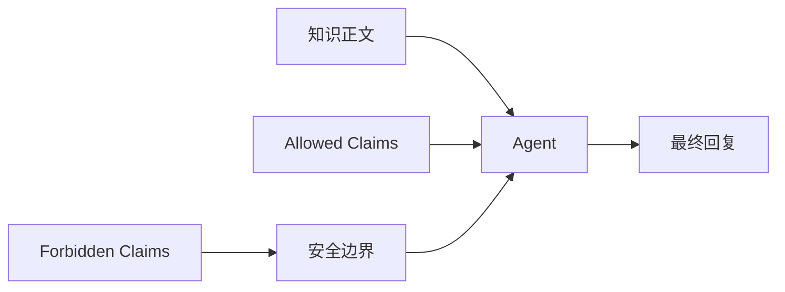

只给正文是不够的，因为 Agent 可能在组织语言时做过度推断。

例如卡券问题：

| 类型 | 示例 |
| --- | --- |
| 允许表达 | 卡券未展示可能与有效期、适用站点、订单门槛、活动限制有关 |
| 禁止表达 | 承诺用户一定可以使用该卡券 |
| 禁止表达 | 承诺补发卡券或赔偿 |

这能把“知识依据”和“表达边界”拆开，降低高风险业务场景下的错误承诺。

### 4.7 哪些字段参与检索

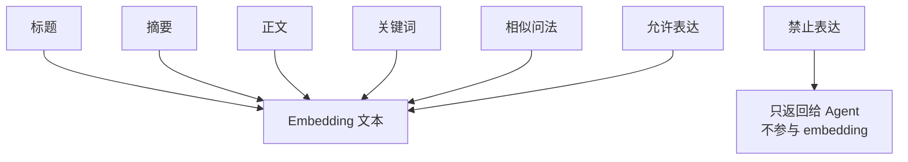

设计原因：

- 标题、摘要、正文、关键词、相似问法能提升召回。
- Allowed Claims 参与检索，是因为它代表可回答事实。
- Forbidden Claims 不参与 embedding，避免“禁止内容”反而提升相关性；它只作为安全边界返回给 Agent。

## 5. 时效性与版本治理

### 5.1 生效、失效、复核三件事分开

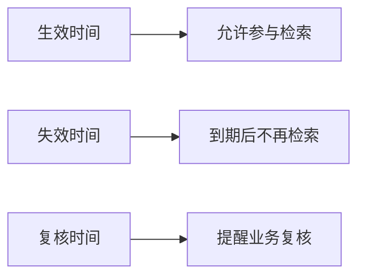

| 字段 | 是否影响检索 | 设计目的 |
| --- | --- | --- |
| `effectiveFrom` | 是 | 防止未生效活动、规则提前被召回 |
| `effectiveTo` | 是 | 防止过期活动、旧规则继续被召回 |
| `reviewDueAt` | 否 | 不直接停用知识，只提醒业务人员复核 |

为什么 `reviewDueAt` 不直接让知识失效：

- 很多规则虽然到复核时间，但可能仍然有效。
- 自动下线可能造成 Agent 找不到本来正确的知识。
- 更合理的方式是提醒负责人复核，由业务确认继续有效、修改或下线。

### 5.2 知识状态流转

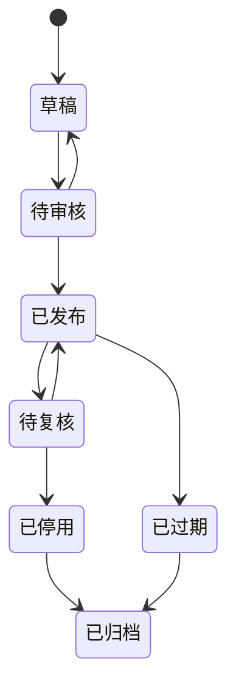

第一版状态通过 Markdown 字段维护：

| 状态 | 是否入库 | 说明 |
| --- | --- | --- |
| 草稿 | 否 | 未完成内容，不参与检索 |
| 待审核 | 否 | 等待业务或负责人确认 |
| 已发布 | 是 | 可参与检索 |
| 已停用 | 否 | 人工下线，不再召回 |
| 已过期 | 否 | 超过失效时间，不再召回 |
| 已归档 | 否 | 保留历史记录 |

### 5.3 不建议物理删除旧知识

旧知识优先采用“停用、过期、归档”，而不是直接删除。

原因：

- 可以追溯历史版本。
- 可以解释某段时间内 Agent 为什么这么回答。
- 可以支持回滚。
- 可以对比新旧知识对召回效果的影响。

## 6. 业务人员如何维护知识

### 6.1 第一阶段：业务给内容，研发协助入库

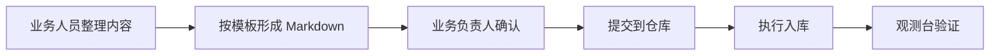

第一版业务人员可以不直接接触所有技术细节，但需要按模板提供：

| 需要业务提供 | 示例 |
| --- | --- |
| 这条知识讲什么 | 怎么扫码充电 |
| 用户常见问法 | 扫哪里充电、不会扫码怎么办 |
| 可以对用户说什么 | 连接充电枪后可在小程序扫码启动 |
| 不能对用户承诺什么 | 不能承诺一定启动成功 |
| 生效和失效时间 | 活动规则、卡券规则特别需要 |
| 负责人和复核时间 | 后续过期提醒和缺口分派使用 |

### 6.2 第二阶段：独立知识仓库

当知识越来越多，建议拆出独立知识仓库：

```text
dalizai-knowledge-base/
  knowledge/
  eval/
  publish/
```

这样做的好处：

- RAG 服务代码和业务知识分离。
- 业务知识可以有独立审批和发布节奏。
- 不需要每次改知识都改服务代码。
- 可以针对知识仓库做更细粒度权限控制。

### 6.3 第三阶段：知识维护平台

长期来看，业务人员不应该直接写 Markdown，而应该在 Web 平台上维护知识。

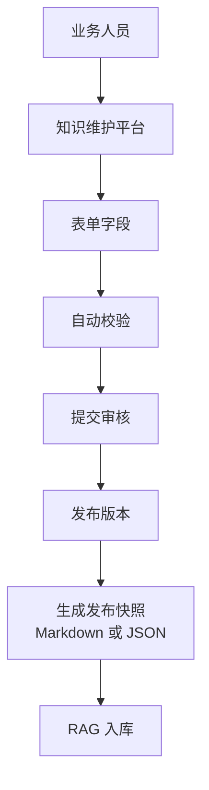

平台不是简单的“编辑器”，而是知识治理系统。

## 7. 知识维护平台设计

### 7.1 平台核心页面

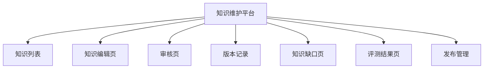

| 页面 | 主要功能 |
| --- | --- |
| 知识列表 | 按业务域、知识类型、状态、负责人、复核时间筛选 |
| 知识编辑页 | 表单化维护 Markdown 中的所有字段 |
| 审核页 | 高风险知识、规则政策、活动内容发布前审核 |
| 版本记录 | 查看每次修改差异，支持回滚 |
| 知识缺口页 | 查看未命中/低置信聚类，转成补知识任务 |
| 评测结果页 | 查看每次发布前后的召回效果变化 |
| 发布管理 | 生成发布快照，触发 RAG 入库和 alias 切换 |

### 7.2 Markdown 字段如何映射到 Web 表单

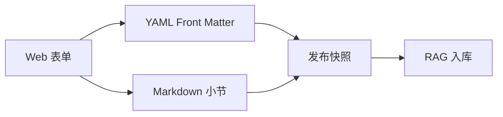

| Web 表单项 | 对应 Markdown 字段 |
| --- | --- |
| 文档 ID | `docId` |
| 文档标题 | `docTitle` |
| 业务域 | `businessDomain` |
| 知识类型 | `knowledgeType` |
| 风险等级 | `riskLevel` |
| 状态 | `status` |
| 负责团队 | `ownerTeam` |
| 负责人 | `owner` |
| 生效时间 | `effectiveFrom` |
| 失效时间 | `effectiveTo` |
| 更新时间 | `updatedAt` |
| 复核时间 | `reviewDueAt` |
| 适用渠道 | `channels` |
| 适用城市 | `cityCodes` |
| 适用站点 | `stationIds` |
| 知识标题 | 二级标题中的标题部分 |
| 知识 ID | 二级标题中的 `knowledgeId` |
| 摘要 | `Summary` |
| 正文 | `Content` |
| 允许表达 | `Allowed Claims` |
| 禁止表达 | `Forbidden Claims` |
| 关键词 | `Keywords` |
| 相似问法 | `Similar Questions` |
| 评测问题 | `Eval Questions` |

也就是说，Markdown 不是和平台冲突的方案。Markdown 是第一版的知识载体，也可以成为后续平台的导入导出格式或发布快照格式。

### 7.3 编辑页草图

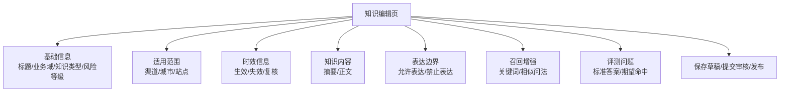

### 7.4 平台校验规则

| 校验类型 | 示例 |
| --- | --- |
| 必填校验 | 标题、正文、允许表达、生效时间、复核时间不能为空 |
| 唯一性校验 | `knowledgeId` 全局唯一 |
| 风险校验 | 高风险知识必须填写禁止表达 |
| 时效校验 | 失效时间不能早于生效时间 |
| 内容校验 | 禁止表达不能和允许表达互相冲突 |
| 范围校验 | 站点级知识必须填写站点范围 |
| 评测校验 | 发布前至少有一个可回归的问题 |

### 7.5 平台审批流

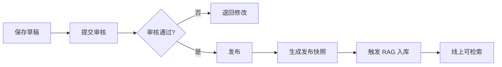

审批规则建议：

| 知识类型 | 审批建议 |
| --- | --- |
| 普通 FAQ | 业务负责人审核 |
| 操作指引 | 业务负责人或产品审核 |
| 卡券、退款、计费规则 | 业务负责人 + 风控/财务相关方审核 |
| 赔偿、投诉、风险提示 | 客服负责人 + 法务/风控审核 |

### 7.6 复核提醒机制

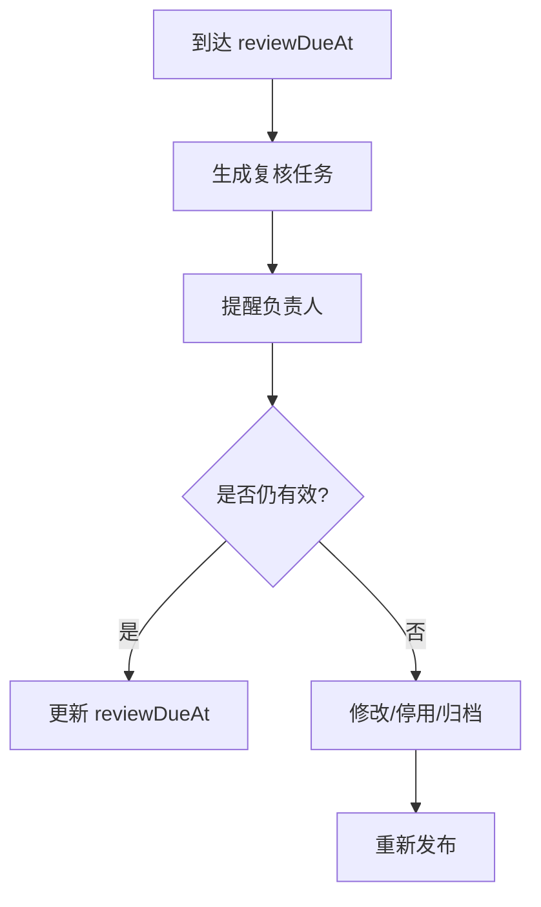

复核提醒不等于自动删除旧知识。平台只提醒业务人员处理，由业务确认继续有效、修改、停用或归档。

## 8. 检索策略设计

### 8.1 Query Rewrite 策略

当前采用：**单次 Qwen 语义归一化 + 多短句扩展**。

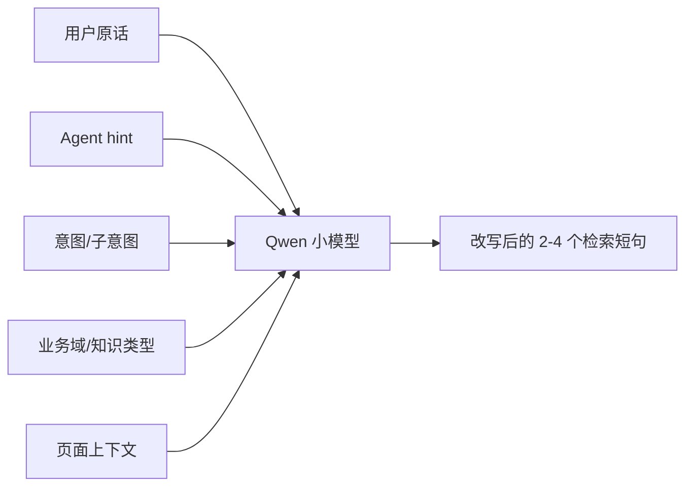

示例：

```text
用户原话：这个券咋用不了
Agent hint：卡券无法使用原因
页面上下文：订单结算页
RAG 改写：卡券无法使用原因；这个券咋用不了；订单结算页未展示卡券；卡券使用规则
```

为什么改写放在 RAG 侧：

- 改写直接影响召回效果。
- 改写需要理解知识库结构、标题风格、关键词、相似问法。
- RAG 侧可以根据 badcase 统一优化 rewrite、切片、索引和 rerank。
- Agent 侧可以提供 hint，但不应该强行替代 RAG 的最终改写。

### 8.2 召回、重排和阈值

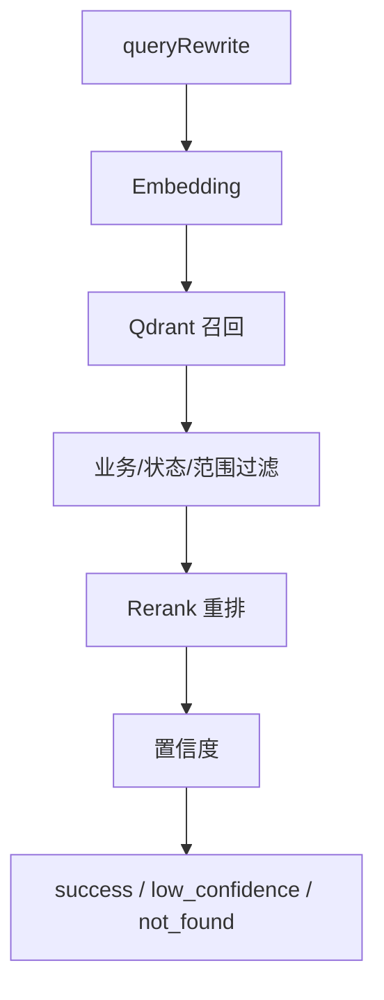

| 状态 | 含义 | Agent 动作 |
| --- | --- | --- |
| `success` | 命中且可回答 | 基于 allowedClaims 组织回复 |
| `low_confidence` | 有候选但不够确定 | 谨慎回答、澄清或转人工 |
| `not_found` | 未找到可信知识 | 不编造，澄清、转人工或改调业务 MCP |
| `error` | 服务或依赖异常 | 安全兜底，可短重试 |

### 8.3 从 Markdown 到 Qdrant point

入库时，每个知识条目会被转换成一个 Qdrant point。这个 point 包含两部分：

```mermaid
flowchart LR
    Item[KnowledgeItem] --> EmbText[Embedding 文本]
    Item --> Payload[Qdrant Payload]
    EmbText --> Vector[1024 维向量]
    Vector --> Point[Qdrant Point]
    Payload --> Point
```

#### 8.3.1 Embedding 文本

当前用于 embedding 的文本结构如下：

```text
标题：怎么扫码充电？
业务域：charging
知识类型：faq
摘要：用户连接充电枪后，可以通过小程序扫码启动充电。
关键词：扫码、二维码、启动充电、连接充电枪
相似问法：怎么扫码充电？；第一次用大力仔怎么开始充电？；扫哪里可以启动充电？
正文：用户到达站点后，需要先将充电枪正确连接车辆……
允许表达：用户连接充电枪后，可以在小程序中扫码启动充电。；余额不足或设备不可用时，系统会在启动前提示。
```

设计原因：

| 字段 | 是否进 embedding | 原因 |
| --- | --- | --- |
| 标题 | 是 | 通常最接近用户问题和 FAQ 标准问法 |
| 业务域 | 是 | 增强领域语义，例如充电、卡券、退款 |
| 知识类型 | 是 | 帮助区分 FAQ、规则、故障排查 |
| 摘要 | 是 | 用简短语言概括知识核心 |
| 关键词 | 是 | 补充业务标准词和同义词 |
| 相似问法 | 是 | 覆盖用户口语化表达 |
| 正文 | 是 | 提供完整语义内容 |
| 允许表达 | 是 | 代表可回答事实，应该帮助召回 |
| 禁止表达 | 否 | 只作为安全边界返回，避免禁止内容影响召回相关性 |
| 评测问题 | 否 | 只用于评测，不作为正式知识内容召回 |

#### 8.3.2 Qdrant Payload

每个 point 的 payload 大致结构如下：

```json
{
  "knowledgeId": "faq_charge_scan_001",
  "chunkId": "faq_charge_scan_001#main",
  "title": "怎么扫码充电？",
  "businessDomain": "charging",
  "knowledgeType": "faq",
  "riskLevel": "low",
  "summary": "用户连接充电枪后，可以通过小程序扫码启动充电。",
  "content": "用户到达站点后，需要先将充电枪正确连接车辆……",
  "allowedClaims": ["用户连接充电枪后，可以在小程序中扫码启动充电。"],
  "forbiddenClaims": ["一定可以启动成功。"],
  "keywords": ["扫码", "二维码", "启动充电"],
  "similarQuestions": ["怎么扫码充电？", "扫哪里可以启动充电？"],
  "knowledgeVersion": "kb_20260723_060523",
  "status": "active",
  "ownerTeam": "用户运营",
  "owner": "张三",
  "effectiveFrom": "2026-07-23T00:00:00+08:00",
  "effectiveTo": null,
  "updatedAt": "2026-07-23T00:00:00+08:00",
  "reviewDueAt": "2026-10-23T00:00:00+08:00",
  "channels": ["wechat_mini_program"],
  "cityCodes": [],
  "stationIds": [],
  "source": {
    "docId": "doc_charging_faq_v1",
    "docTitle": "充电常见问题",
    "section": "怎么扫码充电？",
    "updatedAt": "2026-07-23T00:00:00+08:00"
  }
}
```

payload 的作用：

| payload 字段 | 用途 |
| --- | --- |
| `knowledgeId/chunkId` | 召回追溯、评测命中、日志审计 |
| `businessDomain/knowledgeType` | Qdrant 检索过滤 |
| `riskLevel` | 后续支持不同风险等级和阈值策略 |
| `allowedClaims/forbiddenClaims` | Agent 组织回复和安全边界控制 |
| `status` | 只检索 active 知识 |
| `channels/cityCodes/stationIds` | 按渠道、城市、站点做范围过滤 |
| `knowledgeVersion` | 识别当前知识版本，支持发布追溯 |
| `source` | 返回给 Agent 和观测台，用于定位原始文档 |

### 8.4 Qdrant 检索过滤逻辑

查询时，RAG 会先用 `queryRewrite` 生成查询向量，然后在 Qdrant 中按 filter 检索。

```mermaid
flowchart TB
    Query[queryRewrite] --> Vector[查询向量]
    Vector --> Filter[构造 Qdrant Filter]
    Filter --> Recall[query_points topN]
    Recall --> Payload[返回 payload，不返回向量]
    Payload --> Rerank[进入 rerank]
```

当前过滤条件：

| 条件 | 规则 |
| --- | --- |
| 业务域 | 如果请求传了业务域，只召回对应业务域 |
| 知识类型 | 如果请求传了知识类型，只召回对应类型 |
| 状态 | `effectiveOnly=true` 时，只召回 `status=active` |
| 渠道 | 文档 `channels` 为空表示通用；否则必须匹配请求 channel |
| 城市 | 文档 `cityCodes` 为空表示通用；否则必须匹配请求 cityCode |
| 站点 | 文档 `stationIds` 为空表示通用；否则必须匹配请求 stationId |

范围过滤的设计：

```mermaid
flowchart LR
    Request[请求带 cityCode/stationId/channel] --> Match[匹配同范围知识]
    Request --> Global[同时允许通用知识]
    NoScope[请求不带范围] --> OnlyGlobal[只召回通用知识]
```

这样可以避免一个站点专属规则，在用户没有站点上下文时被误召回。

### 8.5 召回、重排和返回

Qdrant 只负责第一阶段粗召回，最终排序由 rerank 决定。

```mermaid
flowchart TB
    Qdrant[Qdrant topN 候选] --> RerankText[拼 rerank 文本]
    RerankText --> Rerank[Qwen Rerank]
    Rerank --> Sort[按分数排序]
    Sort --> TopK[截取 topK]
    TopK --> Status[按阈值生成状态]
```

rerank 文本会包含：

```text
标题
摘要
关键词
相似问法
正文
允许表达
```

返回给 Agent 的结果中不返回向量，只返回结构化知识：

```text
knowledgeId
chunkId
title
summary
content
score
allowedClaims
forbiddenClaims
source
knowledgeVersion
```

### 8.6 Collection 和 Alias 发布

每次入库不是直接覆盖线上 collection，而是创建一个新的实际 collection。

```mermaid
flowchart LR
    Build[构建新 collection<br/>dalizai_knowledge_时间戳] --> Count[校验 point 数]
    Count --> Pass{是否通过?}
    Pass -- 是 --> Alias[切换 alias<br/>dalizai_knowledge_v1]
    Pass -- 否 --> Keep[保留旧 alias]
    Alias --> Query[线上查询继续访问 alias]
```

设计原因：

- 入库失败不会破坏当前可用索引。
- 查询服务只认 alias，不需要关心实际 collection 名称。
- 可以保留历史 collection，用于回滚和排查。
- `knowledgeVersion` 会写入 payload 和入库记录，便于定位某次发布的知识版本。

### 8.7 关于时效字段和 Qdrant 的关系

时效字段会进入 Qdrant payload，用于追溯、展示和后续治理。

| 字段 | 当前作用 | 后续平台化作用 |
| --- | --- | --- |
| `effectiveFrom` | 入库校验和 payload 记录 | 发布前控制未生效知识不能发布 |
| `effectiveTo` | 入库校验和 payload 记录 | 到期后自动转为过期或从发布快照剔除 |
| `reviewDueAt` | 入库校验和 payload 记录 | 生成复核任务，不直接下线 |

设计上更推荐在“发布快照生成”阶段处理时效，而不是每次查询时复杂判断：

```mermaid
flowchart LR
    Platform[知识平台] --> Snapshot[只生成当前应发布知识]
    Snapshot --> Ingest[RAG 入库]
    Ingest --> Qdrant[Qdrant 中主要保存可检索知识]
    Query[线上查询] --> Qdrant
```

这样查询链路更简单、更稳定，也避免每次检索都做复杂时间判断。

## 9. 观测、评测和知识缺口

### 9.1 开发观测台

观测台用于研发和 Agent 联调，不是业务人员维护平台。

```mermaid
flowchart TB
    Console[观测台] --> Input[模拟用户输入]
    Console --> Rewrite[查看原话和改写句]
    Console --> Recall[查看召回知识]
    Console --> Claims[查看允许/禁止表达]
    Console --> Score[查看置信度]
    Console --> Raw[查看原始响应]
```

观测台最关键的价值是能看清：

```text
用户到底问了什么
RAG 改写成了什么
召回了哪些知识
为什么是 success / low_confidence / not_found
```

### 9.2 评测闭环

```mermaid
flowchart LR
    Eval[评测问题] --> Run[批量评测]
    Run --> Metrics[召回/精确/相关/忠实]
    Metrics --> Badcase[Badcase]
    Badcase --> Improve[改知识/改 rewrite/调阈值]
    Improve --> Eval
```

后续会参考 RAGAS 的四类指标：

| 指标方向 | 关注点 |
| --- | --- |
| Faithfulness | Agent 回复是否忠实于召回上下文 |
| Response Relevancy | 回复是否回应用户问题 |
| Context Precision | 召回结果是否少噪声、排序是否靠前 |
| Context Recall | 是否召回了回答所需的关键知识 |

### 9.3 知识缺口闭环

```mermaid
flowchart TB
    Miss[未命中/低置信] --> Log[记录问题]
    Log --> Cluster[问题聚类]
    Cluster --> Task[形成补知识任务]
    Task --> Biz[业务人员补充知识]
    Biz --> Review[审核发布]
    Review --> Eval[回归评测]
    Eval --> Online[重新入库]
```

这个机制是后续知识平台的重要入口。它能告诉业务人员：用户经常问什么，但知识库还没覆盖好。

## 10. 安全、审计和隐私

### 10.1 敏感数据原则

```mermaid
flowchart LR
    Query[用户问题] --> Mask[脱敏记录]
    User[用户 ID / 会话 ID] --> Hash[Hash 存储]
    BizData[订单/余额/退款/设备实时状态] --> MCP[业务 MCP]
    BizData -.不进入.-> RAG[RAG 知识库]
```

原则：

- RAG 不保存用户明文身份。
- query 和 originalQuery 脱敏后记录。
- 订单明细、余额、退款进度、设备实时状态不进入 RAG。
- 命中的知识 ID、文档 ID、版本需要记录，方便审计。

### 10.2 高风险内容控制

| 风险场景 | 控制方式 |
| --- | --- |
| 卡券、活动、优惠 | 返回 forbiddenClaims，禁止承诺一定可用或补发 |
| 退款、计费 | 禁止根据静态规则判断具体订单金额或进度 |
| 投诉、赔偿 | 引导转人工，禁止 Agent 承诺赔偿 |
| 法务和强监管内容 | 需要更高审核等级和更严格阈值 |

## 11. 技术选型说明

| 能力 | 第一版选型 | 设计原因 |
| --- | --- | --- |
| API 服务 | FastAPI | 类型清晰、开发快，适合服务化接口 |
| 向量库 | Qdrant | 支持向量检索、payload 过滤、alias 发布，本地 Docker 易部署 |
| Embedding | DashScope Qwen embedding | 中文效果较好，第一版无需本地 GPU |
| Rerank | DashScope Qwen rerank | 提升 FAQ、规则、故障排查类知识排序质量 |
| Query Rewrite | DashScope Qwen 小模型 | 能结合 Agent 上下文生成更适合知识库的检索短句 |
| 知识源 | Markdown + Git | 快速启动、可审计、可回滚，后续可作为平台发布快照 |
| 元数据 | SQLite | 第一版轻量保存审计、缺口、入库记录，后续可迁移数据库 |
| 部署 | Docker Compose | 方便本地和联调环境快速启动 |

后续所有模型调用都应该保持 provider 抽象，避免和单一供应商强绑定。

## 12. 风险与应对策略

| 风险 | 说明 | 应对策略 |
| --- | --- | --- |
| 知识质量风险 | 业务知识写得不准、过期或缺少边界 | 模板、字段校验、审核、复核提醒、评测回归 |
| 检索效果风险 | 用户口语表达和知识标题不一致 | Qwen query rewrite、相似问法、rerank、badcase 闭环 |
| 业务真值混淆 | Agent 把实时业务问题误交给 RAG | 明确路由边界，订单/退款/设备状态必须查 MCP |
| 云模型依赖 | 模型接口超时或不可用 | 超时、短重试、失败兜底、provider 抽象、后续模型网关 |
| Markdown 维护门槛 | 业务人员长期直接写 Markdown 不现实 | 中后期建设知识维护平台，表单化维护 |
| 隐私风险 | 日志中可能出现用户敏感信息 | hash、脱敏、敏感业务数据不入库 |
| 存储演进风险 | SQLite 不适合长期多人协作和平台化 | 第一版轻量使用，平台期迁移到业务数据库 |

## 13. 阶段规划

```mermaid
flowchart LR
    V01[v0.1<br/>独立 RAG 主链路] --> V02[v0.2<br/>观测评测闭环]
    V02 --> V03[v0.3<br/>知识治理增强]
    V03 --> V10[v1.0<br/>知识平台化]
```

| 阶段 | 目标 | 重点能力 |
| --- | --- | --- |
| v0.1 | 打通独立 RAG 服务 | Agent 接口、Markdown 入库、Qdrant 召回、rerank、审计 |
| v0.2 | 让效果可看、可评、可优化 | 观测台、评测集、badcase、知识缺口聚类 |
| v0.3 | 让知识治理更稳定 | 独立知识仓库、复核提醒、发布报告、版本保留 |
| v1.0 | 让业务人员可自主维护 | 知识维护平台、表单编辑、审核流、版本管理、发布回滚 |

## 14. 最终设计目标

```mermaid
flowchart TB
    Goal[最终目标] --> Reliable[Agent 回答有依据]
    Goal --> Governed[知识有治理]
    Goal --> Maintainable[业务可维护]
    Goal --> Observable[效果可观测]
    Goal --> Evolvable[架构可演进]
```

最终希望形成的是一套“业务知识治理 + RAG 检索服务 + Agent 使用规范”的闭环：

- 业务人员维护知识。
- 平台校验、审核、发布知识。
- RAG 只读取已发布知识并提供可追溯召回。
- Agent 基于召回结果组织回复。
- 线上问题和未命中反向推动业务补知识。
