# 独立知识 RAG 服务设计汇报稿 v1.0

## 1. 汇报摘要

### 1.1 一句话定位

独立知识 RAG 服务是面向 Agent 的“知识依据召回层”：负责把用户问题映射到可追溯、可审计、可治理的业务知识，不直接生成最终对客回复。

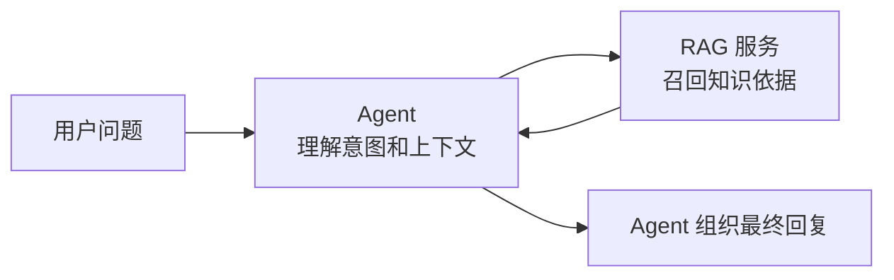

### 1.2 核心价值

| 主线 | 价值 |
| --- | --- |
| 业务价值 | 让 Agent 回答有依据，减少编造，降低高风险业务承诺 |
| 工程架构 | 将知识检索从 Agent 主链路中拆出，独立维护、独立评测、独立迭代 |
| 知识治理 | 从 Markdown 起步，逐步演进到业务人员可维护的知识平台 |
| 效果评测 | 通过观测台、评测集、知识缺口和 badcase 闭环持续提升召回质量 |

### 1.3 当前设计原则

| 原则 | 说明 |
| --- | --- |
| RAG 不直接回答用户 | RAG 返回知识依据、允许表达、禁止表达；最终话术由 Agent 生成 |
| 业务真值不进 RAG | 订单金额、退款进度、设备实时状态等必须查业务 MCP |
| 知识可追溯 | 每个结果返回知识 ID、片段 ID、来源文档、版本信息 |
| 先可用，后平台化 | 第一版 Markdown + Git；中后期建设知识维护平台 |
| 检索链路可观测 | 观测原话、改写结果、召回结果、置信度、命中来源 |

## 2. 项目背景与目标

### 2.1 背景

Agent 在处理业务问题时，会遇到两类信息：

| 类型 | 示例 | 推荐来源 |
| --- | --- | --- |
| 静态知识 | 怎么扫码充电、优惠券规则、发票流程、转人工规则 | RAG 知识库 |
| 实时业务真值 | 订单扣了多少钱、退款到哪了、这个桩是否可用 | 业务 MCP / 业务系统 |

如果静态知识散落在 Agent prompt、代码 mock、业务文档或人工经验里，会带来几个问题：

- 知识更新不统一。
- Agent 容易编造或越权承诺。
- 无法评测召回质量。
- 无法知道哪些问题没知识覆盖。
- 后续多个 Agent 复用成本高。

### 2.2 建设目标

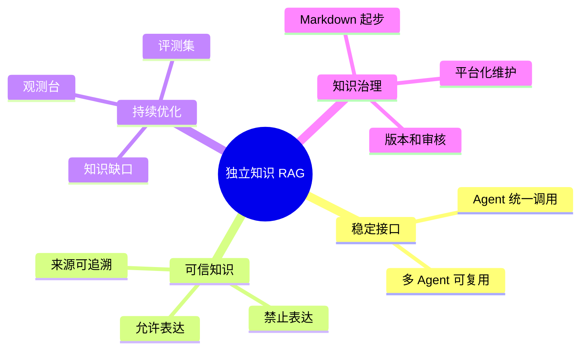

### 2.3 非目标

| 不做什么 | 原因 |
| --- | --- |
| 不生成最终对客回复 | 最终回复需要结合 Agent 上下文、渠道风格和业务实时数据 |
| 不查询实时业务数据 | RAG 知识库不是业务数据库，不能替代 MCP |
| 第一版不做在线编辑接口 | 知识编辑需要审核、权限、版本、发布流程，不能简单暴露写接口 |
| Qdrant 不作为知识主库 | Qdrant 是向量索引，主知识仍需有可治理的来源 |

## 3. 职责边界

### 3.1 Agent 与 RAG 分工

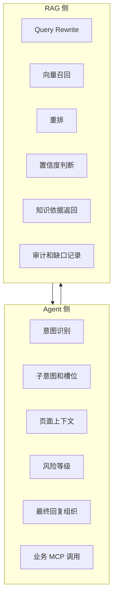

### 3.2 RAG 返回什么

| 返回内容 | 作用 |
| --- | --- |
| 命中状态 | 告诉 Agent 是否可以基于知识回答 |
| 置信度 | 告诉 Agent 回答的可靠程度 |
| 知识片段 | 给 Agent 组织回答时参考 |
| 允许表达 | Agent 可直接采用的事实边界 |
| 禁止表达 | 防止 Agent 承诺赔偿、绝对化结论或编造 |
| 来源信息 | 支持审计、排查、知识追溯 |
| 改写后的查询 | 用于观测和审计，不作为业务结论 |

### 3.3 典型调用边界

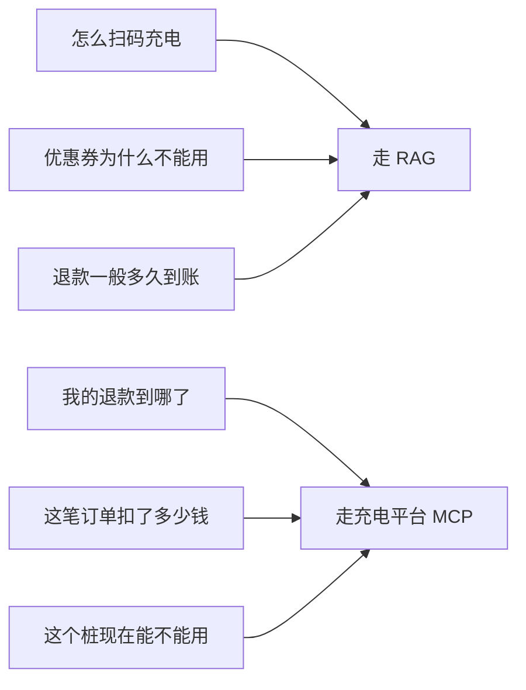

## 4. 总体架构

### 4.1 系统视图

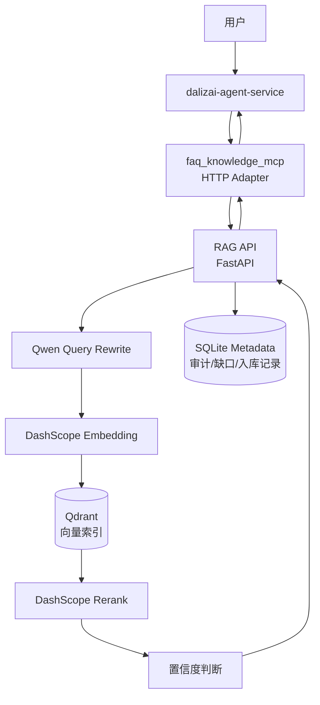

### 4.2 模块拆分

| 模块 | 职责 |
| --- | --- |
| API 层 | 鉴权、请求校验、健康检查、调试接口、管理查询接口 |
| Query Rewrite | 调用 Qwen 小模型，将口语问题改写成检索短句 |
| Retriever | 调用 Qdrant 做向量召回和过滤 |
| Reranker | 调用 Qwen rerank 模型重排候选知识 |
| Ingestion | 解析 Markdown、校验知识、生成 embedding、发布索引 |
| Metadata | 入库记录、审计日志、知识缺口、缺口聚类 |
| Privacy | 用户 ID、会话 ID hash，query 脱敏 |
| Debug Console | 给开发人员模拟查询、观察召回和改写结果 |

### 4.3 部署视图

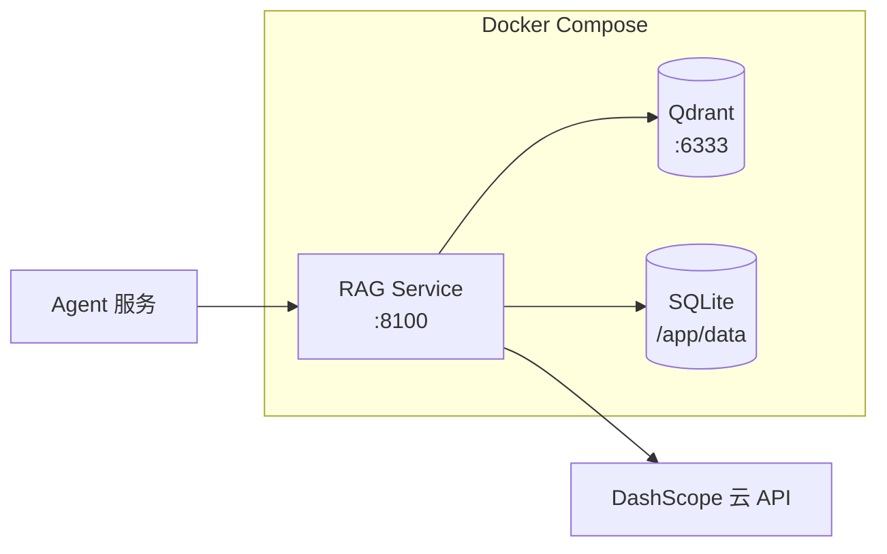

## 5. 技术选型说明

### 5.1 选型总览

| 能力 | 第一版选型 | 选择原因 |
| --- | --- | --- |
| API 框架 | FastAPI | 类型清晰、接口开发快、适合服务化 |
| 向量库 | Qdrant | 部署简单、过滤能力成熟、适合独立 RAG 服务 |
| Embedding | DashScope Qwen embedding | 免本地 GPU、中文能力好、接入成本低 |
| Rerank | DashScope Qwen rerank | 提高 FAQ/规则类知识排序准确性 |
| Query Rewrite | DashScope Qwen 小模型 | 利用 Agent 上下文把口语问题转成业务检索短句 |
| 知识源 | Markdown + Git | 第一版成本低、可审计、可回滚、方便业务样本沉淀 |
| 元数据 | SQLite | 第一版轻量可用，保存审计、缺口、入库记录 |
| 部署 | Docker Compose | 本地联调和小规模环境启动简单 |

### 5.2 为什么选 Qdrant

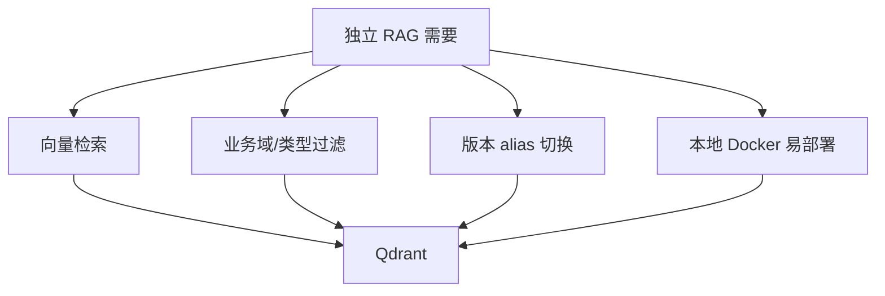

要点：

- 支持向量检索 + payload filter，适合按业务域、知识类型、渠道过滤。
- 支持 collection 和 alias，适合入库后切换版本。
- Docker 启动简单，联调成本低。
- Qdrant 只作为检索索引，不承担知识主库职责。

### 5.3 为什么用云模型

| 考虑 | 说明 |
| --- | --- |
| 本地环境 | 当前不依赖本机 GPU，降低启动门槛 |
| 中文效果 | Qwen 系列对中文业务问法和规则文本友好 |
| 研发效率 | 第一版先验证 RAG 链路和治理闭环 |
| 后续可替换 | provider 层抽象，后续可接本地模型或内部模型网关 |

### 5.4 为什么不让 RAG 直接生成回复

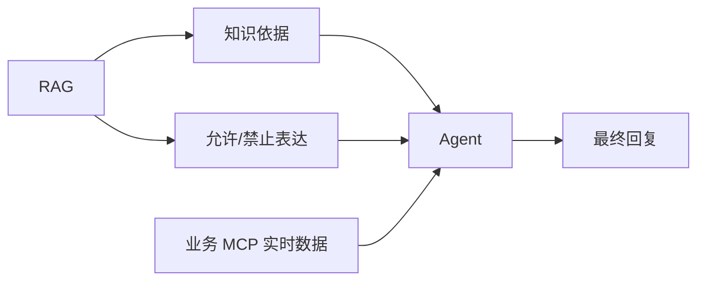

原因：

- 回复需要结合实时业务数据，RAG 不掌握订单、账户、设备状态。
- 回复需要遵守 Agent 的对话策略、渠道语气、上下文记忆。
- RAG 直接生成话术会模糊责任边界，增加错误承诺风险。

### 5.5 为什么第一版不用 MySQL

| 阶段 | 存储策略 | 原因 |
| --- | --- | --- |
| 第一版 | Markdown + SQLite + Qdrant | 快速搭建、方便本地联调、治理链路先跑通 |
| 中期 | 独立知识仓库 + 发布快照 | 知识和代码解耦，便于业务协作 |
| 后期 | 知识平台 + 数据库主库 | 支持权限、审核、版本、发布、复核、操作日志 |

## 6. 知识数据设计

### 6.1 第一版知识组织

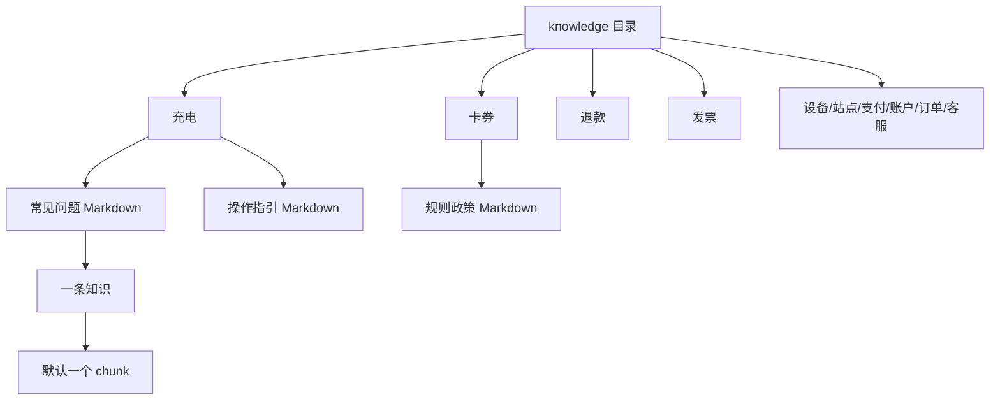

### 6.2 业务域与知识类型设计理念

| 维度 | 设计理念 |
| --- | --- |
| 业务域 | 第一版覆盖充电、卡券、退款、发票、设备、站点、支付、账户、订单、客服等常见业务域 |
| 知识类型 | 第一版覆盖常见问题、操作指引、规则政策、故障排查、转人工和风险提示等 |
| 组合关系 | 第一版不强制限制组合，只给推荐组合，避免过早锁死业务扩展 |
| 中文维护 | 业务人员在平台上看到中文名称，底层再映射为系统字段 |
| 可扩展 | 后续通过配置化枚举维护，不把业务枚举写死在代码里 |

### 6.3 知识条目结构

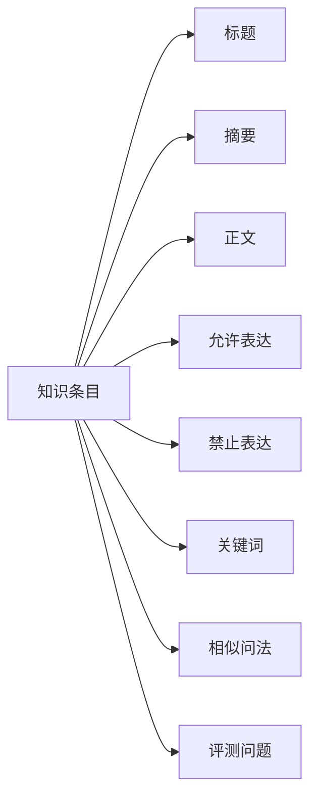

| 字段 | 用途 |
| --- | --- |
| 标题 | 用于召回、展示、追溯 |
| 摘要 | 帮助 Agent 快速理解知识内容 |
| 正文 | 作为回答组织参考 |
| 允许表达 | Agent 可安全使用的事实边界 |
| 禁止表达 | 防止绝对化、赔偿承诺、越权判断 |
| 关键词/相似问法 | 提高 embedding 和 rerank 命中率 |
| 评测问题 | 用于构造评测集，不进入正式对客知识 |

### 6.4 生命周期状态

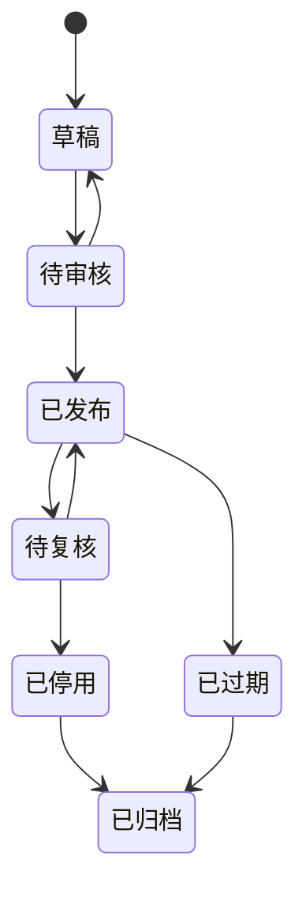

第一版只检索“已发布且在有效期内”的知识。旧知识不建议物理删除，优先停用、过期或归档，保留审计追溯能力。

## 7. 知识治理与平台化演进

### 7.1 总体理念

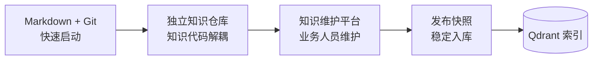

### 7.2 为什么后续需要知识平台

| 当前痛点 | 平台能力 |
| --- | --- |
| 业务人员不适合长期直接改 Markdown | 表单化编辑，中文字段，模板引导 |
| 知识质量依赖人工约定 | 必填校验、格式校验、风险字段校验 |
| 高风险知识需要审核 | 审批流、发布权限、操作日志 |
| 知识过期不易发现 | 复核任务、到期提醒、负责人机制 |
| 难以沉淀 badcase | 知识缺口聚类、补知识工单、评测回归 |
| 发布风险不可控 | 版本管理、灰度发布、回滚 |

### 7.3 平台职责边界

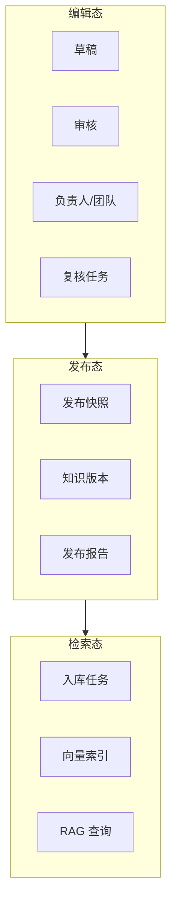

平台负责编辑、审核、版本和发布；RAG 只读取已发布知识，不直接读取编辑中的草稿。

## 8. 检索链路设计

### 8.1 查询主链路

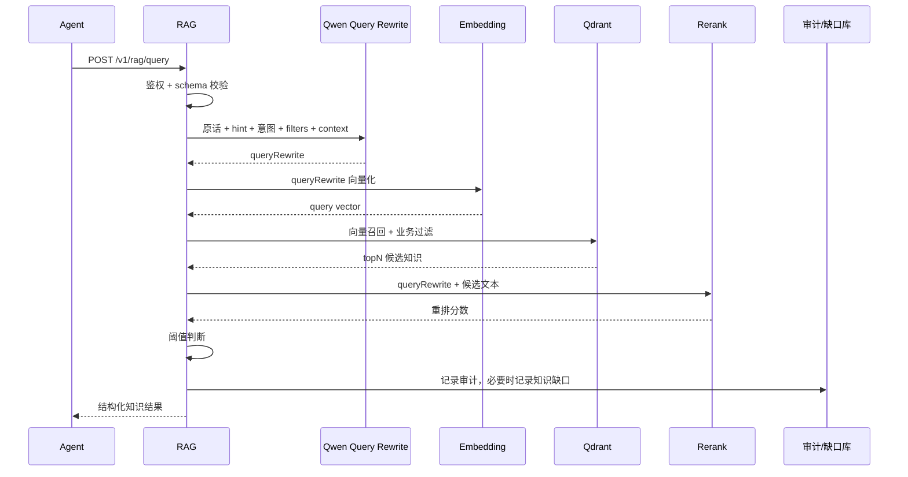

### 8.2 Query Rewrite 策略

当前选择：**单次 Qwen 语义归一化 + 多短句扩展**。

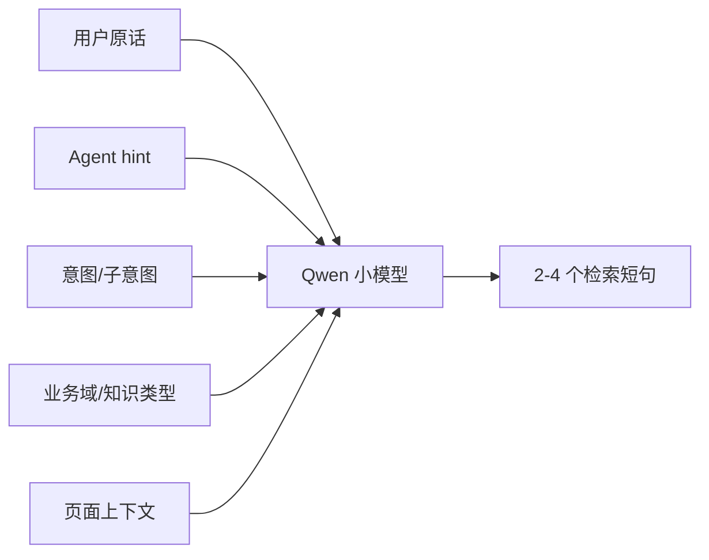

策略说明：

| 设计点 | 说明 |
| --- | --- |
| RAG 侧负责最终改写 | 改写直接影响召回，应和切片、索引、rerank 一起优化 |
| Agent hint 只作信号 | Agent 可以传归一化提示，但不替代 RAG 的最终改写 |
| 多短句输出 | 同时覆盖口语表达、业务标准表达、FAQ 标题表达和页面上下文 |
| JSON 输出 | 控制模型输出格式，降低解析不确定性 |
| 失败兜底 | 模型异常或 JSON 无效时退回原 query，保证服务可用 |

示例：

```text
原话：这个券咋用不了
Agent hint：卡券无法使用原因
页面：订单结算页
RAG queryRewrite：卡券无法使用原因；这个券咋用不了；订单结算页未展示卡券；卡券使用规则
```

### 8.3 召回与重排

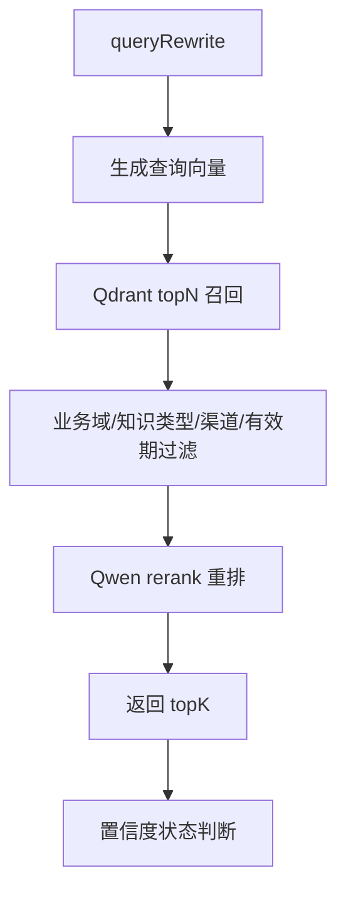

| 步骤 | 目的 |
| --- | --- |
| 向量召回 | 先找语义相近候选知识 |
| 业务过滤 | 避免跨域误召回 |
| rerank | 让候选排序更贴近当前问题 |
| 阈值判断 | 控制是否允许 Agent 基于知识回答 |

### 8.4 状态判断

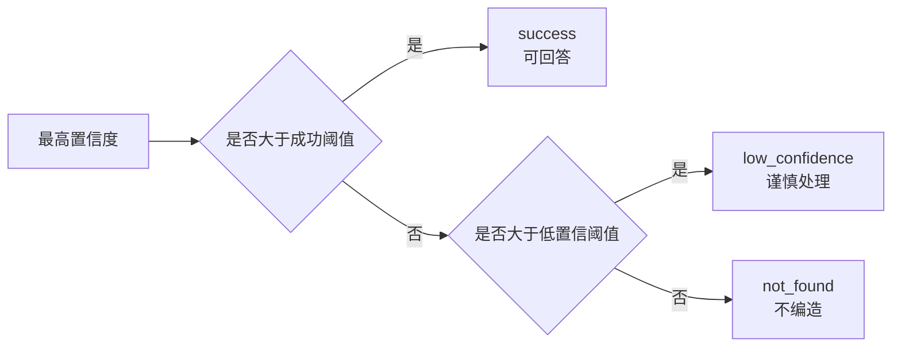

| 状态 | Agent 建议动作 |
| --- | --- |
| success | 基于 allowedClaims 组织回复 |
| low_confidence | 澄清、谨慎回答或转人工 |
| not_found | 不编造，澄清、转人工或改调业务 MCP |
| error | 安全兜底，可按 retryable 短重试 |

## 9. Agent 接口协议概述

### 9.1 调用方式

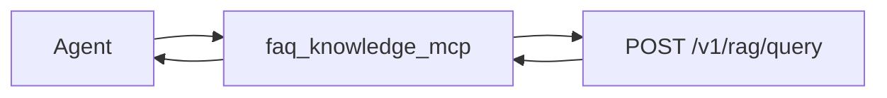

接口概述：

| 项 | 说明 |
| --- | --- |
| 路径 | `POST /v1/rag/query` |
| 鉴权 | `Authorization: Bearer RAG_SERVICE_API_KEY` |
| Agent 传入 | 用户问题、意图、上下文、过滤条件、topK |
| RAG 返回 | 命中状态、置信度、知识依据、允许表达、禁止表达、来源信息 |
| 详细字段 | 以接口协议文档为准 |

### 9.2 Health Check

| 接口 | 用途 | 鉴权 |
| --- | --- | --- |
| `/health` | 容器进程探活 | 无 |
| `/v1/health` | Agent 联调 readiness | 无 |
| `/ready` | 管理员 readiness 详情 | Admin Key |

`/v1/health.status=ready` 表示已有成功入库记录，且 Qdrant alias 可查询。

## 10. 入库与发布设计

### 10.1 入库流程

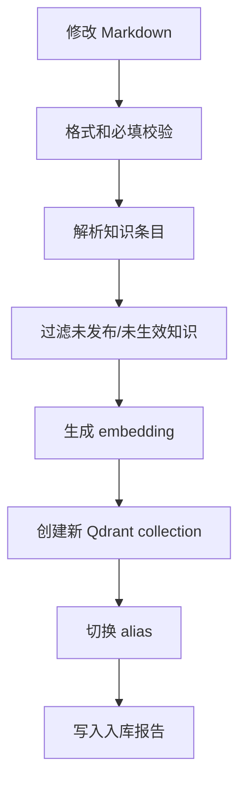

### 10.2 Alias 安全发布

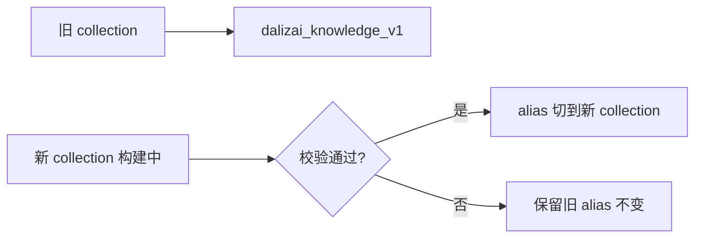

设计效果：

- 入库失败不影响线上查询。
- 查询服务始终访问稳定 alias。
- 支持保留最近版本，便于回滚。

## 11. 观测与评测设计

### 11.1 开发观测台

```mermaid
flowchart TB
    Input[输入原话/query/hint/filter/context] --> Run[运行查询]
    Run --> Observe[观察结果]
    Observe --> O1[原话]
    Observe --> O2[改写后的句子]
    Observe --> O3[命中知识]
    Observe --> O4[置信度]
    Observe --> O5[允许/禁止表达]
    Observe --> O6[原始 JSON]
```

观测台定位：开发联调和效果调试，不作为业务人员知识维护平台。

### 11.2 评测闭环

```mermaid
flowchart LR
    Case[评测问题] --> Run[批量评测]
    Run --> Metric[指标统计]
    Metric --> Badcase[Badcase 分析]
    Badcase --> Improve[优化知识/query rewrite/rerank/阈值]
    Improve --> Case
```

评测关注：

| 指标方向 | 说明 |
| --- | --- |
| 上下文召回 | 是否召回了期望知识片段 |
| 上下文精确 | 返回结果里噪声是否过多 |
| 回答相关性代理 | 召回内容是否和问题相关 |
| 忠实性代理 | allowedClaims 是否能支撑 Agent 回复 |

### 11.3 知识缺口闭环

```mermaid
flowchart TB
    Miss[not_found / low_confidence] --> Log[记录知识缺口]
    Log --> Cluster[问题聚类]
    Cluster --> Review[业务复核]
    Review --> Add[补充或修订知识]
    Add --> Eval[回归评测]
    Eval --> Publish[重新入库发布]
```

缺口聚类后，可以作为业务人员更新知识的任务来源。

## 12. 安全、审计与隐私

### 12.1 数据安全边界

```mermaid
flowchart LR
    Sensitive[敏感/实时数据] --> Block[不进入 RAG]
    Query[用户问题] --> Mask[脱敏记录]
    User[用户ID/会话ID] --> Hash[Hash 存储]
    Result[命中知识ID] --> Audit[审计日志]
```

### 12.2 审计记录

| 记录项 | 用途 |
| --- | --- |
| 请求 ID / Trace ID | 链路排查 |
| 会话和用户 hash | 问题归因，不暴露明文身份 |
| 脱敏后的 query | 分析召回和知识缺口 |
| filters / intent | 分析 Agent 路由质量 |
| 命中知识 ID | 知识追溯和效果评估 |
| 状态和置信度 | 质量统计 |
| 耗时和错误码 | 性能与稳定性排查 |

### 12.3 高风险知识控制

| 机制 | 目的 |
| --- | --- |
| allowedClaims | 限定 Agent 可以表达什么 |
| forbiddenClaims | 阻止 Agent 绝对化承诺或越权判断 |
| 风险提示类知识 | 引导转人工或调用业务 MCP |
| 置信度阈值 | 低置信时不让 Agent 直接当确定答案 |

## 13. 当前风险与应对策略

| 风险 | 表现 | 应对策略 |
| --- | --- | --- |
| 知识质量不足 | 召回到了旧知识或缺少关键知识 | 模板校验、复核提醒、业务负责人、评测集回归 |
| 检索效果波动 | 口语问题、跨域问题召回不稳 | Qwen query rewrite、rerank、badcase 调优、阈值分层 |
| 云模型依赖 | 网络抖动、超时、供应商异常 | 超时控制、失败兜底、短重试、provider 抽象、后续模型网关 |
| Agent 路由错误 | 实时业务问题误走 RAG | 明确业务真值边界，Agent 优先调用业务 MCP |
| 知识维护成本 | Markdown 长期维护门槛高 | 中后期建设知识平台，表单化、审批、版本、复核 |
| 数据隐私 | 日志中出现用户敏感信息 | hash、脱敏、敏感字段不入库、日志保留周期 |
| 存储演进 | SQLite 不适合长期多人治理 | 第一版轻量使用，后续迁移知识平台数据库 |

## 14. 阶段规划与里程碑

```mermaid
flowchart LR
    V01[v0.1<br/>基础链路] --> V02[v0.2<br/>观测评测]
    V02 --> V03[v0.3<br/>知识治理]
    V03 --> V10[v1.0<br/>平台化生产]

    V01 --> A[查询接口<br/>Markdown 入库<br/>Qdrant 召回<br/>Rerank]
    V02 --> B[观测台<br/>评测集<br/>Badcase 闭环<br/>知识缺口聚类]
    V03 --> C[独立知识仓库<br/>复核提醒<br/>发布报告<br/>版本保留]
    V10 --> D[知识维护平台<br/>审批流<br/>权限<br/>监控告警<br/>灰度发布]
```

### 14.1 阶段目标表

| 阶段 | 目标 | 重点产出 |
| --- | --- | --- |
| v0.1 | 打通 RAG 独立服务主链路 | 查询接口、知识格式、入库、召回、重排、基础审计 |
| v0.2 | 让效果可观测、可评测、可优化 | 观测台、评测集、badcase、知识缺口聚类 |
| v0.3 | 让知识治理流程稳定 | 独立知识仓库、复核任务、发布报告、版本保留 |
| v1.0 | 进入平台化和生产化 | 知识维护平台、审批流、权限、监控告警、灰度发布 |

## 15. 后续设计理念

### 15.1 从“工具”变成“知识基础设施”

```mermaid
flowchart LR
    Tool[单 Agent FAQ 工具] --> Service[独立 RAG 服务]
    Service --> Infra[多 Agent 知识基础设施]
    Infra --> Platform[业务知识治理平台]
```

RAG 不应只是一个检索接口，而应逐步承担知识资产治理能力：

- 统一知识入口。
- 统一发布流程。
- 统一评测标准。
- 统一审计追溯。
- 支持多个 Agent 复用。

### 15.2 业务人员是知识质量第一责任人

```mermaid
flowchart TB
    Business[业务人员] --> Platform[知识平台]
    Platform --> Validate[字段校验/风险校验]
    Validate --> Review[审核]
    Review --> Publish[发布]
    Publish --> RAG[RAG 入库]
    RAG --> Agent[Agent 使用]
    Agent --> Gap[知识缺口反馈]
    Gap --> Business
```

研发负责平台、工具、校验和发布链路；业务人员负责知识内容准确性和更新及时性。

### 15.3 可替换模型，不绑定供应商

| 层 | 设计 |
| --- | --- |
| Query Rewrite | provider 抽象，当前 Qwen，后续可接内部模型 |
| Embedding | provider 抽象，当前 DashScope，后续可本地化 |
| Rerank | provider 抽象，当前 Qwen rerank，后续可按效果替换 |
| 向量库 | 当前 Qdrant，保留迁移可能 |

## 16. 汇报时可强调的结论

```mermaid
flowchart TB
    C1[独立 RAG 不是为了替代 Agent]
    C2[它是为了让 Agent 回答有依据]
    C3[不是知识主库，而是知识检索服务]
    C4[不是一次性项目，而是知识治理闭环]
    C5[第一版快速落地，后续平台化演进]
```

建议对组长强调：

| 结论 | 说明 |
| --- | --- |
| 边界清楚 | RAG 找知识，Agent 组织话术，业务 MCP 查实时数据 |
| 架构可扩展 | 模型、向量库、知识源都有抽象和演进空间 |
| 治理可持续 | 从 Markdown 到知识平台，逐步让业务人员维护 |
| 效果可优化 | 观测台、评测集、缺口聚类形成持续改进闭环 |
| 风险可控 | 高风险内容通过 forbiddenClaims、阈值、转人工策略控制 |
